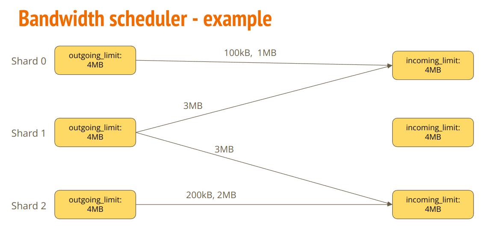
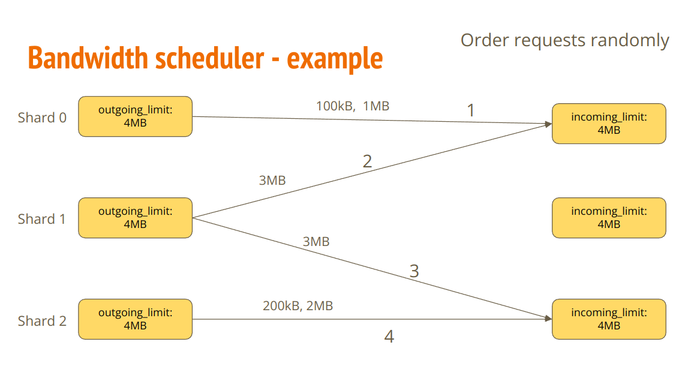
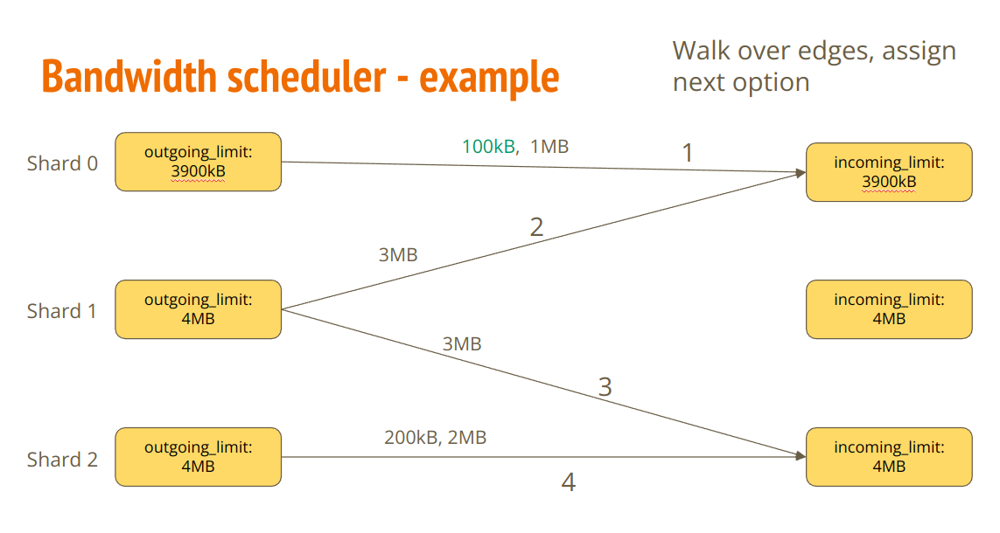
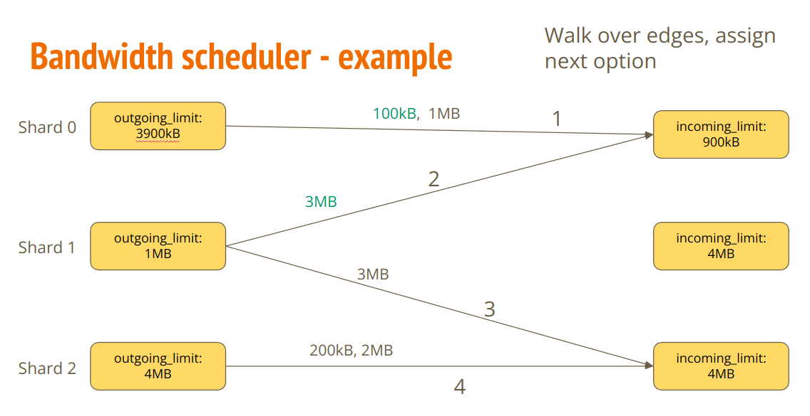
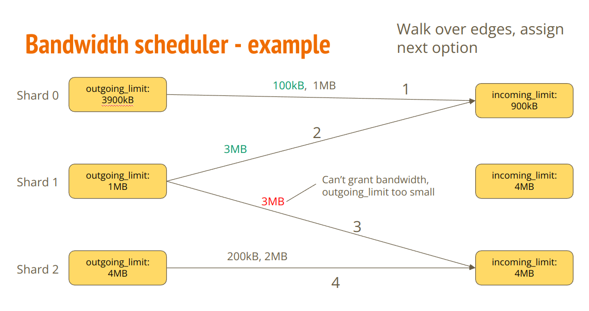
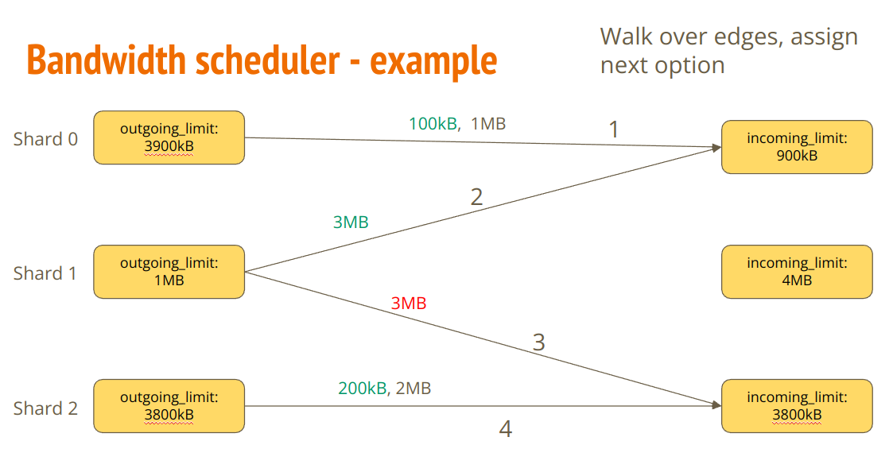
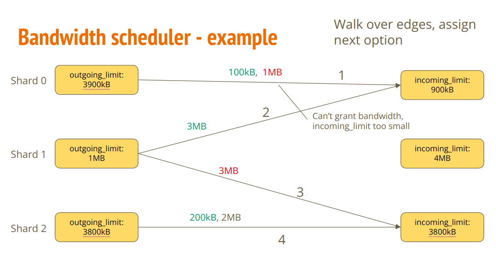
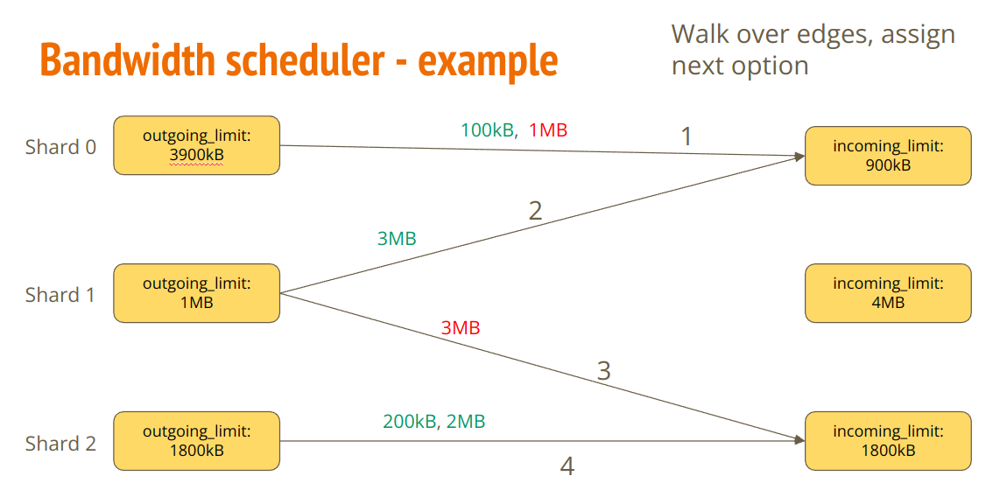
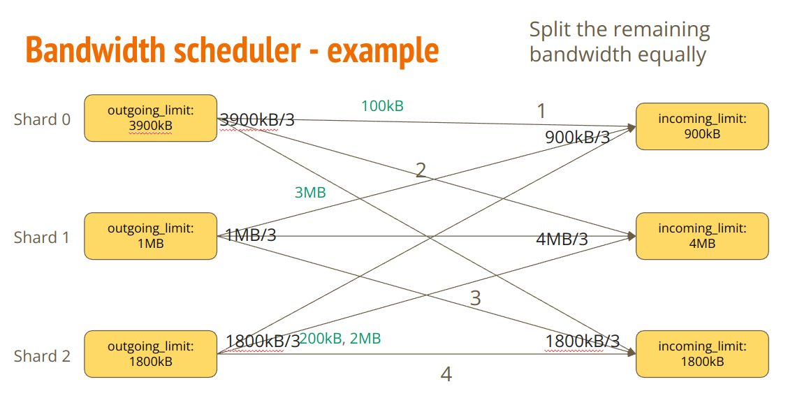

## Summary

When a chunk is applied it produces outgoing receipts that are sent to other shards. The size of receipts to send could potentially be large and the shard might not be able to transfer all of the receipts before the next block, which could result in missing chunks. The incoming receipts are also included in the `ChunkStateWitness` and we must make sure that its size stays under control. Let's limit how many receipts can be sent out to make sure that the nodes have enough bandwidth to send them in time.
We already implemented a basic version of bandwidth limits in the stateless validation NEP ([NEP-509](https://github.com/near/NEPs/blob/master/neps/nep-0509.md)), but it's very barebones, it severely limits the bandwidth to stay on the safe side. Let's implement a proper solution to support higher cross-shard bandwidth.

## Motivation

#### Why do we need bandwidth limits?

NEAR is a sharded blockchain - every shard is expected to do a limited amount of work at every height. Scaling is mostly achieved by adding more shards. This also means that we cannot expect a shard to send or receive more than X MB of data at every height. Without bandwidth limits some shards might be forced to do a lot of work, more than the shard is capable of. Asking the shard to process more work than it can handle would result in delays, missed chunks and possibly even chain stalls. It makes sense to add a limit on how much the shard sends/receives at every height, it's in line with NEAR's sharded design.

We haven't really experienced any serious issues caused by large cross-shard traffic in mainnet, but recent protocol changes have caused the issue to become more a cause for concern:
- With stateless validation all of the incoming receipts are kept inside `ChunkStateWitness`. The protocol is very sensitive to the size of `ChunkStateWitness` - when `ChunkStateWitness` becomes too large, the nodes are not able to distribute it in time and there are chunk misses, in extreme cases a shard can even stall. We have to make sure that the size of incoming receipts is limited to avoid witness size issues and attacks.
- The number of incoming receipts to a shard scales linearly with the number of shards - the more shards there are, the more receipts they send. As we add more and more shards the size of incoming receipts will become more of an issue, at some point we'd have to introduce the limits to prevent nodes from getting overloaded by incoming receipts. Without these limits NEAR is not scalable. In the last year the number of shards increased by 50%, we might get to 10 shards by the end of year. We need NEAR to be scalable if we want to keep increasing the number of shards.


#### Why is the current solution inadequate?

There is a rudimentary solution in place, added together with stateless validation in [NEP-509](https://github.com/near/NEPs/blob/master/neps/nep-0509.md) to limit witness size.
In this solution each shard is usually allowed to send 100KiB (`outgoing_receipts_usual_size_limit`) of receipts to another shard, but there's one special shard that is allowed to send 4.5MiB (`outgoing_receipts_big_size_limit`). The special allowed shard is switched on every height in a round robin fashion. If a shards wants to send less than 100KiB it can just do it, but for larger transfers the sender needs to wait until it's the allowed shard to send the receipts. A node can only send more than 100KiB on its turn. See the PR for a more detailed description of the solution: https://github.com/near/nearcore/pull/11492

This solution was simple enough to be implemented before stateless validation launch, but there is a number of issues with this approach:

- Small throughput - If we take two shards - `1` and `2`, then `1` is able to send at most 5MiB of data to `2` every 6 blocks (assuming 6 shards). That's only 800KiB / height, even though in theory NEAR could support 5MiB / height (assuming that other shards aren't sending much). That's a lot unused throughput that we can't make use of because of the overly restrictive limits. There are some use cases that could make use of higher throughput, e.g NEAR DA, although last I heard NEAR DA was moving to a design that doesn't require a lot of cross-shard bandwidth.
- Hiccups on large receipts - when a receipt is larger than 100KiB, it can't be sent until the sender is the allowed shard, which could take up to `num_shards` blocks. The outgoing receipt queue is a FIFO queue, so all the other receipts are stuck behind the large receipt as well. This means that a single large receipt can block all outgoing receipts for a few blocks. This is undesirable because it increases latency for all these receipts and makes DoS attacks easier. The problem will become more pronounced once more shards are added. On current mainnet traffic receipts larger than 100KiB occur about once per 1000 blocks, so it's not that big of an issue, but this could change in the future.
- Missing chunks - when a chunk is missing, the next chunk receives both the receipts aimed at the previous chunk and the new one. If there were a few missing chunks in a row, the next chunk will receive incoming receipts from all of the missing ones. We must make sure that the total size of incoming receipts from all these heights doesn't get too large. The current solution deals with this by marking a shard as congested if there were too many missing chunks in a row. A fully congested shard can't receive any receipts, so after a few heights other shards will stop sending receipts to the shard with missing chunks. The shard will receive receipts from a few heights at most. This makes the problem smaller, but doesn't fully fix it. Receipts from multiple heights could still add up to over 15MB, which is quite large. There are also issues with allowed shard, which is allowed to send receipts to fully congested shards, which could make the problem worse in some corner cases.

The current solution has many deficiencies that could be solved by a better approach.

## Specification

[Explain the proposal as if you were teaching it to another developer. This generally means describing the syntax and semantics, naming new concepts, and providing clear examples. The specification needs to include sufficient detail to allow interoperable implementations getting built by following only the provided specification. In cases where it is infeasible to specify all implementation details upfront, broadly describe what they are.]


The main source of wasted bandwidth in the current algorithm is that assigning bandwidth doesn't take into account the needs of individual shards. When shard `1` needs to send 500KiB and shard `2` needs to send 20KiB, the algorithm can assign all of the bandwidth to shard `2` even though it doesn't really need it, it just happened to be the allowed shard at this height. This is wasteful, it would be much better if the algorithm could see how much each shard needs and give to each according to their needs.
This is the general idea behind the new solution: each shard requests bandwidth according to its needs and bandwidth scheduler divides the bandwidth between everone that requested it. The bandwidth scheduler would be able to see that shard `2` needs 500KiB of bandwidth and it'd give it to `2`.
The flow will look like this:

- A chunk is applied and produces outgoing receipts to other shards.
- The shard calculates the current limits and sends as many receipts as it's allowed to.
- The receipts that can't be sent due to limits are buffered (saved to state), they will be sent later.
- The shard calculates how much bandwidth it needs to send the buffered receipts and creates a `BandwidthRequest` with this information (there's one `BandwidthRequest` per target shard).
- The list of `BandwidthRequest` from this shard is included in the chunk header and distributed to other nodes.
- When the next chunk is applied it gathers all the `BandwidthRequests` from chunk headers at the previous height(s) and uses `BandwidthScheduler` to calculate the current bandwidth limits in a deterministic way. The same calculation is performed on all shards and all shards arrive at the same bandwidth limits.
- The chunk is applied and produces outoging receipts, receipts are sent until they hit the limits set by `BandwidthScheduler`.

### `BandwidthRequest`

A shard looks at its queue of buffered receipts to another shard and generates a `BandwidthRequest` which describes how much bandwidth the shard would like to have.
In the simplest version a `BandwidthRequest` could be a single integer containing the total size of buffered receipts.
But there is a problem with this simple representation - it doesn't say anything about the size of individual receipts. Let's say that two shards want to send 4MB of data each to another shard, but the incoming limit is 5MB. Should we assign 2.5MB of bandwidth to each of the sender shards? That would work if the shards want to send a lot of small receipts, but it wouldn't work when each shard wants to send a single 4MB receipt. A shard can't send a part of the 4MB receipt, it's either the whole receipt or nothing. The scheduler should assign 2.5MB/2.5MB of bandwidth when the receipts are small and 4MB/0MB when they're large. The simple version doesn't have enough information for the scheduler to make the right decision, so we'll use a richer representation.

The richer reprenentation is a list of possible bandwidth grants that make sense for this shard. When a shard wants to send a single 4MB receipt it doesn't make sense to assign it 100kB or 2MB of bandwidth, so it's list of possible grants that make sense will contain a single entry: [4MB]. OTOH when a shard wants to send a ton of small receipts, its list of possible grants will contain all possible options: [200kB, 300kB, 400kB, ..., 3900kB, 4MB]. When there are many small receipts increasing the bandwidth grant by 100kB allows to sends more receipts, so it makes sense to communicate that assigning 100kB more makes sense. In the single receipt example increasing the grant by 100kB wouldn't change anything, so it's not included in the sensible options.

As an example, let's say that the outgoing receipts buffer has receipts with these sizes (receipts will be sent from left to right):
```
[150kB, 60kB, 400kB, 1MB, 50kB, 300kB]
```
The cumulative sum (sum from 0 to i) of sizes is:
```
[150kB, 210kB, 610kB, 1610kB, 1660kB, 1960kB]
```
The bandwidth grant options in the generated `BandwidthRequest` will be:
```
[200kB, 300kB, 700kB, 1700kB, 2000kB]
```

Explanation:
* Granting 200kB of bandwidth will allow to send the first receipt.
* Granting 300kB will allow to send the first two receipts.
* Granting 400kB would give the same result as 300kB, so it's not included in the options
* Granting 700kB would allow to send the frist three receipts
* etc etc

Conceptually a `BandwidthRequest` looks like this:

```rust
struct BandwidthRequest {
    /// Requesting bandwidth to this shard
    to_shard: ShardId,
    /// Please grant me one of the options listed here.
    possible_bandwidth_grants: Vec<usize>
}
```

A list of such requests will be included in the chunk header:

```rust
struct ChunkHeader {
    bandwidth_requests: Vec<BandwidthRequest>
}
```

With this representation of `BandwidthRequest`, the list of bandwidth requests could take up a lot of space in the chunk header. Luckily it's possible to significantly reduce its size using a better representation.
First we could use `u8` instead `u64` for the `ShardId`, NEAR currently has only 6 shards and it'll take a while to reach 255. There's no need to handle 10**18 shards.
Second we can use a bitmask for the `possible_bandwidth_grants`. The requests don't have to be very precise, 100kB granularity would be sufficient. Assuming that the maximum grant is 4.5MB, we could use 45 bits to represent all posible requests. Having `1` in the `n-th` bit would mean that one of the options is `(n+1) * 100kB`. With these optimizations a single `BandwidthRequest` would be only 7 bytes in size. It's possible to further reduce the size by lowering granulariy and/or using exponential scale. 

So the actual representation of a `BandwidthRequest` would look something like this:
```rust
struct BandwidthRequest {
    to_shard: u8,
    possible_bandwidth_grants_bitmap: [u8; 6]
}
```

Sending less than 100KiB of receipts won't require a `BandwidthRequest`. Every shard will be allowed to send this much without asking for permission. On current mainnet traffic the typical size of receipts to send is below 20kB, so on most heights there won't be any bandwidth requests. Bandwidth requests are needed only for exceptionally large transfers. This helps to save space inside chunk headers, we don't have to keep `num_shards**2` requests for every height.

### Generating bandwidth requests

To generate a bandwidth request the sender shard has to look at the receipts stored in the outgoing buffer to another shard and pick bandwdith grant options that make sense. In this context "makes sense" means that the having this much bandwidth would cause the sender to send more receipts than the previous requested option, as described in the previous section.

The simplest implementation would be to actually walk through the list of outgoing recepipts (starting from the ones that will be sent the soonest) and create a new option every time the total size increases by at least 100kB, like so:

```rust
/// Generate a bitmap of bandwidth requests based on the size of receipts stored in the outgoing buffer.
/// Returns a bitmap with requests.
/// request_bitmap[i] is true when the shard is requesting `(i+1) * 100kB` of bandwidth
fn make_bandwidth_request(buffered_receipts: Vec<Receipt>) -> Vec<bool> {
    let mut total_size: usize = 0;
    let mut request_bitmap: Vec<bool> = vec![false; 46];
    for receipt in buffered_receipts {
        total_size += receipt_size(&receipt);
        let size_index: usize = total_size / 100_000; // total size as a multiple of 100kB
        if size_index < request_bitmap.len() {
            request_bitmap[size_index] = true;
        } else {
            break; // Don't request more than 4.5MB, there's no point
        }
    }
    request_bitmap[0] = false; // Don't request 100kB, everyone is granted this much by default
    request_bitmap
}
```

Walking over all receipts in the outgoing buffer requires reading a lot of data from the Trie, so it woud be better to implement a more efficient algorithm.

One idea for a more efficient algorithm would be to group receipts into groups of at least 50kB and calculate bandwidth requests using these groups. When a new receipt is added to the outgoing buffer, its added to the last group of receipts. If the size of the group goes above 50kB, a new group is started. When a receipt is removed, it's removed from the first group. If the size of the first group reaches zero, the group is removed.
The number of groups will be small - each group of receipts is at least 50kB, so for 10MB of receipts there will be at most 200 groups. A group is a simple u32, we could keep all the groups in a single trie value similar to `TrieIndices`.
The groups produce less precise requests than individual receipts, but they're much more efficient.

Example code:

```rust

struct OutgoingReceiptsBuffer {
    receipts: VecDeque<Receipt>,
    groups: VecDeque<ReceiptGroup>,
}

struct ReceiptGroup {
    size: usize,
}

const RECEIPT_GROUP_SIZE: usize = 50_000;

impl OutgoingReceiptsBuffer {
    pub fn new() -> Self {
        Self { receipts: VecDeque::new(), groups: VecDeque::new() }
    }

    pub fn push(&mut self, receipt: Receipt) {
        let size = receipt_size(&receipt);

        match self.groups.back_mut() {
            Some(last_group) => {
                last_group.size += size;

                if last_group.size > RECEIPT_GROUP_SIZE {
                    self.groups.push_back(ReceiptGroup { size: 0 });
                }
            }
            None => {
                self.groups.push_back(ReceiptGroup { size });
            }
        }

        self.receipts.push_back(receipt);
    }

    pub fn pop(&mut self) -> Option<Receipt> {
        let receipt = self.receipts.pop_front()?;

        let first_group = self.groups.front_mut().unwrap();
        first_group.size -= receipt_size(&receipt);

        if first_group.size == 0 {
            self.groups.pop_front();
        }

        Some(receipt)
    }

    pub fn make_bandwidth_request(&self) -> Vec<bool> {
        let mut total_size: usize = 0;
        let mut request_bitmap: Vec<bool> = vec![false; 45];
        for group in &self.groups {
            total_size += group.size;
            let size_rounded: usize = total_size / 100_000; // total size as a multiple of 100kB
            if size_rounded < request_bitmap.len() {
                request_bitmap[size_rounded] = true;
            } else {
                break; // Don't request more than 4.5MB, there's no point
            }
        }
        request_bitmap[0] = false; // Don't request bandwidth for the first 100kB
        request_bitmap
    }
}
```

It's worth noting that for the initial implementation of bandwidth limits we don't need to implement proper request generation. We could generate just one option in every bandwidth request - total size of all receipts in the outgoing buffer. `BandwidthScheduler` will still work fine with that, it'll just be less efficient. We can add complex request generation in later versions and keep the initial one simple to reduce scope.

### `BandwidthScheduler`

`BandwidthScheduler` is an algorithm which looks at all of the `BandwidthRequests` submitted by shards and grants the bandwidth in a fair way.

`BandwidthScheduler` has the following inputs:

- A list of bandwidth requests from all shards
- Incoming bandwidth limit for every shard (how much this shard can receive)
- Outgoing bandwidth limit for every shard (hom much this shard can send out)

Based on these inputs the scheduler chooses one of the possibilities for every request.
The incoming and outgoing limits would usually be a constant value (e.g 5MB), but in some situations they can be smaller. For example if a shard had missing chunks, we would take into account how many receipts were already sent and decrease its incoming limit to avoid sending too many receipts to it.

The algorithm works as follows:

- Shuffle the list of bandwidth requests using a deterministic seed (e.g hash of he previous block)
- Walk through the shuffled list and try to grant the first possibility from the request. Update the relevant incoming and outgoing limits.
- Walk through the shuffled list again and try to grant the second possibility.
- Repeat the process until no new possibilities can be granted.
- Distribute the remaining bandwidth equally among all shards (including the ones that didn't request any)

It's best to show on an example:

TODO - better description and example
<details>
<summary>
Click to show the example (lots of pictures)
</summary>










</details>

### Congestion control

The bandwidth scheduler has to be compatible with congestion control. When a shard is fully congested, other shards can't send any receipts to it unless they happen to be the allowed shard. It makes no sense to grant bandwidth to a shard which can't send any receipts because of congestion control. Not taking congestion control into account could lead to dangerous situations where all bandwidth is assigned to shards that can't send anything and no progress is made.
We can deal with this by adjusting the incoming limits based on the congestion control information. The incoming limit for fully congested shards could be set to zero and then bandwidth scheduler won't assign any bandwidth there.

### One block delay

There's a one block dealy between requesting bandwidth and receiving a grant. This is not ideal, most large receipts will have to be buffered and sent out at the next height, it'd be nicer if we could quickly negotiate bandwidth and send them immediately.

It is a hard problem to solve - a shard doesn't know what other shards want to send, so it needs to contact them and negotiate. Maybe it'd be possible to negotiate it off-chain inbetween blocks, but that would be much more complex - we would have to make sure that the negotiation happens quickly even when latency between nodes is high and ensure that everything is fair and secure. The idea is explored furhter in `Option D` section, but for now I think we can go with a solution that is simpler and should be good enough, even though it has a one block delay.

At first glance it might seem that the delay prevents us from using 100% of the bandwidth - a big receipt takes 2 blocks to reach the other shard, doesn't that mean that we get only 50% of the theoretical throughput? Not really, the delay increases latency, but it doesn't affect throughput. An application that wants to utilize 100% of bandwidth can submit the receipts and they'll be queued and sent over utilizing 100% of the bandwidth, just with a one block delay. There's no 50% problem.
As an example one can imagine a contract that wants to send 4MB of data to another shard at every height. The contract will produce a 4MB receipt at every height, the shard will generate a 4MB `BandwidthRequest` at every height, and the bandwidth scheduler will grant the shard 4MB of bandwidth at every height (assuming no requests from other shards). At the first height the 4MB will be buffered, but for all the following heights the shard will have the 4MB grant and it'll be able to send 4MB of data to the other shard.
We can utilize 100% of the bandwidth despite the delay, we just have to make sure that we can buffer ~10MB of receipts in the outgoing queue.

Having one-block delay means that we still have the problem of hiccups when a large receipt blocks smaller receipts, but the problem is much smaller than before - the small receipts will have to wait for one block instead of `num_shards` blocks. One block delay isn't ideal, but I think it's good enough. `num_shards` was more concerning because the delay would get larger and larger as the number of shards grows, which isn't scalable at all.
We could consider having two different queues for small and big receipts to avoid small receipts getting stuck behind big ones, but this is a complex problem and it might not work well with transaction priorities. For now we'll stay with a single queue.

### Transaction priorities

There's a plan to add transaction priorities to NEAR protocol: [NEP-541](https://github.com/near/NEPs/pull/541). Each receipt would have a priority level assigned to it, and receipts with higher priorities would generally be sent before before the ones with small priorities.
It's important to ensure that bandwidth limits will be compatible with transaction priorities. This means that we can't choose to send small receipts before big ones, as the big one could have a higher priority and sending the small one first would cause priority inversion.
The design proposed in this NEP is compatible with transaction priorities because it doesn't affect the order of receipts that are sent, it only limits the speed at which they're sent out. The runtime can choose the order based on priorities and then bandwidth limits can send them out at a reasonable pace.

There's some potential for tighter integration between the two, but that can be left for later.

### Missing chunks

When a chunk is missing, the incoming receipts that were aimed at this chunk are redirected at the first non-missing chunk on this shard. The non-missing chunk will be forced to consume incoming receipts meant for two chunks, or even more if there were multiple missing chunks in a row. This is dangerous because the size of receipts sent to multiple chunks could be bigger than one chunk can handle. We need to make sure that `BandwidthScheduler` is aware of this problem and stops sending data when there are missing chunks on the target shard.

Sadly `BandwidthScheduler` doesn't have the ability to ensure that the situation where receipts aimed at two chunks end up aimed at one chunk never happens. When it decides how much receipts to send it doesn't know if the current chunk will be missing.

TODO: Image here

The only thing `BandwidthScheduler` can do is stop sending receipts when it notices that it sent too many of them. The simplest way to do it would be a condition like `if (previous_chunk_missing_on_target_shard) {dont_send_anything();}`. A more complicated solution would look how much was already sent to the target shard and make sure that when we send new receipts the amount of unprocessed receipts doesn't grow too large.
TODO - describe how `BandwidthScheduler` should handle missing chunks in detail, add some diagrams

Despite the limits maintained by `BandwidthScheduler`, we need something more to deal with the cases where incoming receipts aimed at multiple chunks end up in one chunk. All incoming receipts to a chunk are included in the witness and if their size gets too large, the size of the witness could get large as well, which could cause serious problems. To deal with this we will implement size optimization for witness incoming receipts.

### Size optimization for witness incoming receipts

To deal with situations where there are too many incoming receipts to a chunk, we will add a new rule for chunk application - only the first 4MB of incoming receipts are processed, the rest of incoming receipts will always be delayed.
Thanks to this rule we will be able to do a trick - for the first 4MB of incoming receipts include the actual receipts, for the rest include only lightweight metadata that will be put in the delayed queue. Later when the metadata is read from the delayed queue we will include the actual receipts in the witness and they'll be executed.

The algorithm operates on whole sets of receipts (all receipts sent from some shard at some height), not on individual receipts. It'd be possible to operate on invidvidual receipts, but it would be more complex. Operating on sets of receipts is good enough for now.

It's best to show on an example.
Let's say that a chunk has the following sets of incoming receipts:

- A: 500kB from shard 1 sent at height 100
- B: 1MB from shard 2 sent at height 100
- C: 600kB from shard 3 sent at height 100
- D: 1MB from shard 1 sent at height 101
- E: 1MB from shard 2 sent at height 101
- F: 1MB from shard 3 sent at height 101

When producing a chunk we will keep adding sets of incoming receipts until we hit the size limit.
We will add [A, B, C, D] as the receipts to be processed. Their total size is 3.1MB. Adding E would cause the size of processed receipts to go over 4MB, which isn't allowed. Receipts [E, F] will be delayed.

`ChunkStateWitness` will include whole data for receipts [A, B, C, D]. For [E, F] it will include only small metadata, which will immediately be put in the delayed queue.

Later when another chunk is applied and metdata for `E` is pulled out of the delayed queue, the chunk producer will fetch the receipts from its state, apply them, and put the applied receipts in `ChunkStateWitness` so that stateless chunk validators are able to apply the chunk as well.

Metadata for a set of incoming receipts would look like this:
```rust
struct DelayedReceiptsMetadata {
    /// Hash of all the receipts in the set (Vec<Receipt>)
    hash: CryptHash,
    /// Total size of the receipts in the set
    total_size: usize,
    /// Total congestion gas of delayed receipts in this set
    congestion_gas: Gas,
}
```

Hash of the receipts is used to verify that the receipts provided in the witness are correct. Size and congestion gas are needed for congestion control, which measures how many bytes and gas are stored in the delayed queue.

We will have to extend `prev_outgoing_receipts_root` to prove this metadata. The current version can prove the hash of receipts, but it doesn't contain any information about their size and attached congestion gas.

The delayed receipt queue will probably have to be adjusted to allow putting receipts at the front of the queue. When the runtime pulls out a set of delayed receipts it might not be able to apply all of them and will have to put some of them back in the delayed queue. In this case it should put the individual delayed receipts at the beginning of the queue to maintain the right ordering.

This optimization ensures that the size of incoming receipts in `ChunkStateWitness` never goes above 4MB + size of small metadata. No matter how many incoming receipts there are, size of the witness won't get too high because of them.
There is a corner case when there could be thousands of missing chunks in a row and the size of metadata gets too large as well, but this can be dealt with separately. We can add a rule saying "A shard isn't allowed to send anything when there are more than 10 missing chunks in a row on the target shard", with that kind of rule in place we can include incoming receipts metadata from at most 10 heights, not thousands.

## Reference Implementation

[This technical section is required for Protocol proposals but optional for other categories. A draft implementation should demonstrate a minimal implementation that assists in understanding or implementing this proposal. Explain the design in sufficient detail that:

- Its interaction with other features is clear.
- Where possible, include a Minimum Viable Interface subsection expressing the required behavior and types in a target programming language. (ie. traits and structs for rust, interfaces and classes for javascript, function signatures and structs for c, etc.)
- It is reasonably clear how the feature would be implemented.
- Corner cases are dissected by example.
- For protocol changes: A link to a draft PR on nearcore that shows how it can be integrated in the current code. It should at least solve the key technical challenges.

The section should return to the examples given in the previous section, and explain more fully how the detailed proposal makes those examples work.]

## Security Implications

[Explicitly outline any security concerns in relation to the NEP, and potential ways to resolve or mitigate them. At the very least, well-known relevant threats must be covered, e.g. person-in-the-middle, double-spend, XSS, CSRF, etc.]

## Alternatives

[Explain any alternative designs that were considered and the rationale for not choosing them. Why your design is superior?]

## Future possibilities


### Better scheduling algorithm

[Describe any natural extensions and evolutions to the NEP proposal, and how they would impact the project. Use this section as a tool to help fully consider all possible interactions with the project in your proposal. This is also a good place to "dump ideas"; if they are out of scope for the NEP but otherwise related. Note that having something written down in the future-possibilities section is not a reason to accept the current or a future NEP. Such notes should be in the section on motivation or rationale in this or subsequent NEPs. The section merely provides additional information.]

### Integration with transaction priorities ([NEP-541](https://github.com/near/NEPs/pull/541))

## Consequences

[This section describes the consequences, after applying the decision. All consequences should be summarized here, not just the "positive" ones. Record any concerns raised throughout the NEP discussion.]

### Positive

- p1

### Neutral

- n1

### Negative

- n1

### Backwards Compatibility

[All NEPs that introduce backwards incompatibilities must include a section describing these incompatibilities and their severity. Author must explain a proposes to deal with these incompatibilities. Submissions without a sufficient backwards compatibility treatise may be rejected outright.]

## Unresolved Issues (Optional)

[Explain any issues that warrant further discussion. Considerations

- What parts of the design do you expect to resolve through the NEP process before this gets merged?
- What parts of the design do you expect to resolve through the implementation of this feature before stabilization?
- What related issues do you consider out of scope for this NEP that could be addressed in the future independently of the solution that comes out of this NEP?]

## Changelog

[The changelog section provides historical context for how the NEP developed over time. Initial NEP submission should start with version 1.0.0, and all subsequent NEP extensions must follow [Semantic Versioning](https://semver.org/). Every version should have the benefits and concerns raised during the review. The author does not need to fill out this section for the initial draft. Instead, the assigned reviewers (Subject Matter Experts) should create the first version during the first technical review. After the final public call, the author should then finalize the last version of the decision context.]

### 1.0.0 - Initial Version

> Placeholder for the context about when and who approved this NEP version.

#### Benefits

> List of benefits filled by the Subject Matter Experts while reviewing this version:

- Benefit 1
- Benefit 2

#### Concerns

> Template for Subject Matter Experts review for this version:
> Status: New | Ongoing | Resolved

|   # | Concern | Resolution | Status |
| --: | :------ | :--------- | -----: |
|   1 |         |            |        |
|   2 |         |            |        |

## Copyright

Copyright and related rights waived via [CC0](https://creativecommons.org/publicdomain/zero/1.0/).
